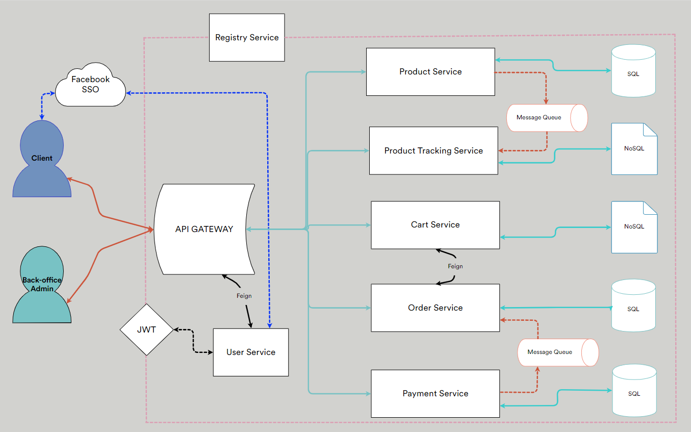
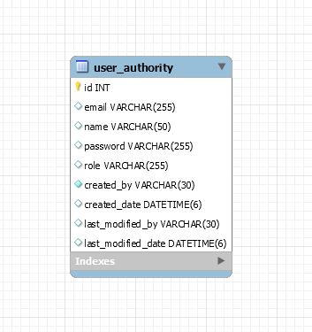
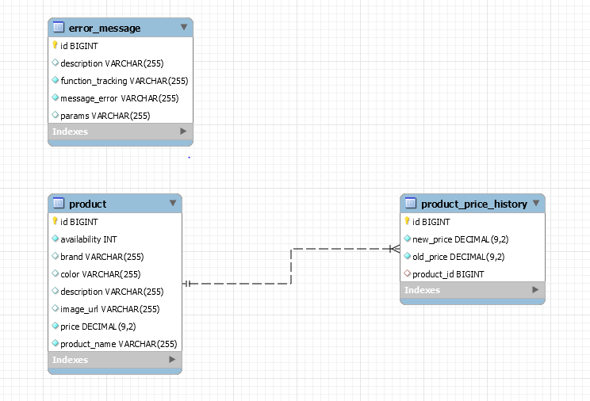
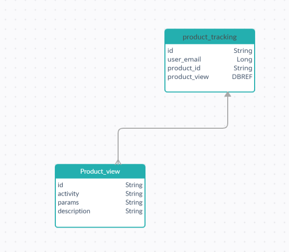
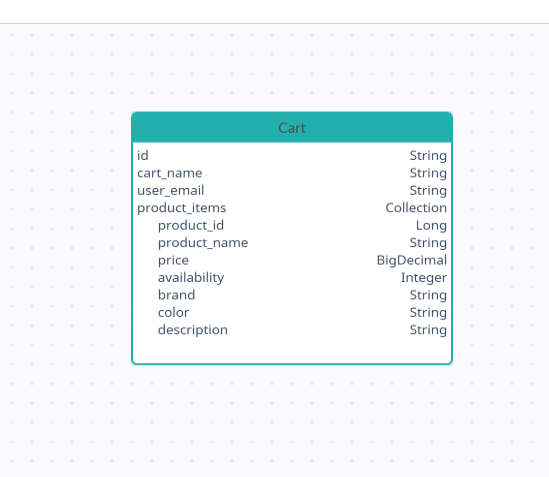
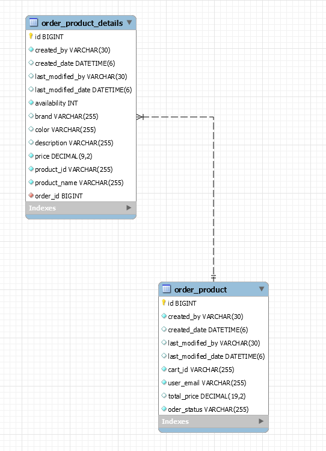
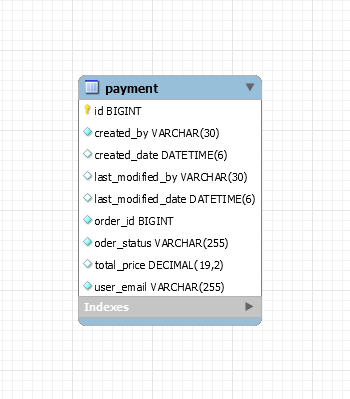

# i-commerce
A small start-up named "iCommerce" wants to build a very simple online shopping  application to sell their products .
## Document Organization
- [SYSTEM DESIGN DOCUMENT](#system-design-document)
  - [1. INTRODUCTION](#1-introduction)
    - [1.1 Purpose and Scope](#1.1-purpose-and-scope)
  - [2. SYSTEM ARCHITECTURE](#2-system-architecture)
    - [2.1 High-level design](#2.1-high-level-design)
    - [2.2 DATABASE DESIGN](#2.2-database-design)
    - [2.3 Folder Structure](#2.3-folder-structure)
    - [2.4 Libaries](#2.4-libaries)
    - [2.5 Services Details](#2.5-services-details)
    - [2.6 Development](#2.6-development)
  - [3. How to run](#3-how-to-run)                         
  - [4. References](#4-references)
## System Design Document
Overview
The System Design Document describes the system requirements, operating environment, system and subsystem architecture, files and database design, input formats, output layouts, human-machine interfaces, detailed design, processing logic, and external interfaces.

### 1. INTRODUCTION
#### 1.1 Purpose and Scope
A small start-up named "iCommerce" wants to build a very simple online shopping application to sell their products.
In order to get to the market quickly, they just want to build an MVP version with a very limited set of functionalities

    1. The application is simply a simple web page that shows all products on which 
    customers can filter, sort, and search for products based on different criteria such as 
    name, price, brand, color, ...
    2. All product prices are subject to change at any time and the company wants to keep 
    track of it.
    3. A product always shows the latest price when showing on the website
    4. If the customer finds a product that they like, they can add it to their shopping cart 
    and proceed to place an order.
    5. For audit support, all customers' activities such as searching, filtering, and viewing 
    product details need to be stored in the database.
    However, failure to store customer activity is completely transparent to customers 
    and should have no impact on the activity itself.
    6. Customers can log in simply by clicking the button “Login with Facebook”. No further 
    account registration is required.
    7. No online payment is supported yet. The customer is required to pay by cash when 
    the product got delivered.
    
### 2. SYSTEM ARCHITECTURE

#### 2.1 HIGH LEVEL DESIGN
iCommerce Architecture :

#### 2.2 Database Design
User Database Diagram

Product Database Diagram

- Product Table : Product Data
- Product Price History : Product Price History Data . Update after Product Price change.
- Error : Tracking Error If message occurs meanwhile Tracking Product process.

Product Tracking Diagram

- Product Tracking : Tracking product view or get functions
- Product View : Tracking for product activity like filter search sort .

Cart Diagram

Order Database Diagram

Order : General Information
Order Details : Product Information in details.

Payment Database Diagram

#### 2.3 Folder Structure
 - i-commerce
   -  api-gateway
   -  cart-service 
   -  order-service
   -  payment-service
   -  product-service
   -  product-tracking-service
   -  registry-service
   -  user-service
   
For each services, the project have 4 layers 
  - Controller
  - Service
  - Repository
  - Entity-Document
  
#### 2.4 Libaries
- spring-boot-starter-web : Web API 
- spring-boot-starter-actuator : Monitoring and Health managements
- spring-boot-starter-data-jpa : Spring Data JPA 
- spring-boot-starter-data-mongodb : Spring starter for using mongoDB with Spring Data MongoDB
- spring-boot-starter-aop : Aspect Oriented Programing
- spring-boot-starter-security : Spring Security 
- spring-cloud-starter-netflix-eureka-client : Eureka Client , Registering Service with Registry Service 
- spring-cloud-starter-netflix-eureka-server : Euraka Server , Registry Server can recognize service and comminication
- spring-cloud-starter-netflix-zuul : API Gateway , Zuul Proxy
- spring-boot-starter-oauth2-client: SSO with Facebook provider
- spring-security-oauth2: SSO with Facebook provider 
- spring-boot-starter-amqp : Message Queue . Using send and recieve message from Rabbit MQ
- spring-cloud-starter-openfeign :  Web service client .A declarative HTTP client by Netflix simplifies our way of interacting with other services
- spring-boot-starter-test : Spring Test component
- spring-boot-devtools : Support for develop environment
- io.jsonwebtoken : JWT bearer token for authentication 
- org.projectlombok : Decrease boiler-plate code 

#### 2.5 Services Details

##### 2.5.1 User Service 
 - Authentication Service
 - Provide JWT for authentication  and authorization for stateless request filter .
 - Management Backoffice Admin and Customer Infomation from Facebook Provider via SSO .
 - Using MySQL for stored user data.
 - Currently , only support for Facebook provider , will be improved for GG , Github , Okta or any Keycloak.
 
 ##### 2.5.2 Product Service
  - Product Management Service .
  - Support show all product with  filter, sort, and search for products based on different criteria such as name, price, brand, color, ...
  - All product prices are subject to change at any time and the company wants to keep track of it
  - For audit support, all customers' activities such as searching, filtering, and viewing product details need to be stored in the database.
    However, failure to store customer activity is completely transparent to customers and should have no impact on the activity itself.
  - For Not impact to customer activity using Spring AOP for traking.
  - Using Message Queue for tracking process .
  - Using MySQL for stored product data.

##### 2.5.3 Product Tracking Service
 - Recieve Message from Message Queue 
 - Handling Failure Data into dead queue.
 - Processing Data and stored into MongoDB
 
 ##### 2.5.4 Cart Service 
 - Cart Management Service 
 - Customer can have multiple cart with different name .
 - Add product to cart .
 - Update product in cart after customer proceed to order process.
 - Using MongoDB for stored data
 
 ##### 2.5.5 Order Service
 - Proceed Order process.
 - Update cart remove product that ordered.
 - Recvie status from payment process to update status in cart .
 - Using MySQl for stored data.
 
 ##### 2.5.6 Payment Service
 - Payment Process
 - Update Status to Cart
 - Using MySQL for Stored data

#### 2.6 Development
 - JDK 11
 - Spring boot 2.4.5
 - Spring v5.3.6
 - Spring Boot v2.3.10.RELEASE - Using for Zuul API Gateway . Because Spring 2.4 still not support for Zuul. Will be facing some issue with Ribbon timeout.
 - MySQL
 - MongoDB
 - RabbitMQ
 - Eclipse 

### 3. How to run 
 - Change Config for gateway.ip = your local ip .
    -  Only for API Gateway IP can access to our services for security reason , you can remove it in WebSecurityConfigruation
 - If you want run into your facebook provider change config into application.yml in Zuul gateway.
 ##### Build
 
 Run `mvn clean install` to build the project.
 
 ##### Running unit tests
 
 Run `mvn test` to execute the unit tests.
 
 ##### Run the Application
 
 Run `mvn spring-boot:run` . Once the application has started, we should be able to access the app using port :
 
  - Registry Service : 8010 
  - API-Gateway : 8011
  - User Service : 8081
  - Product Service : 8082
  - Product Tracking Service : 8083
  - Cart Service : 8084
  - Order Service : 8085
  - Payment Service : 8086
  - MySQL : 3306
  - MongoDB : 27017
  - RabbitMQ : 5672
  - Facebook URL reqeust : http://localhost:8011/oauth2/authorization/facebook or using any url with security.
  - For API Request only used port 8081 via Api gateway.
  - For Registry Service Management using default User/Password : test/test . Can change in configruation file.

 ##### Deploy
 Run `mvnw -Pprod clean verify` to execute build jar file.
 
 ### 4. References
 [Microservice Architecture](https://microservices.io/)
